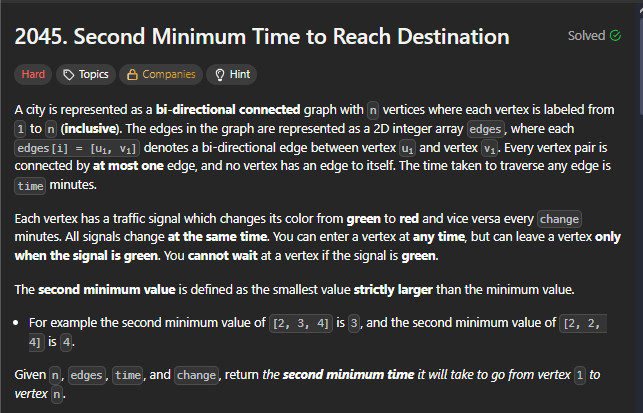
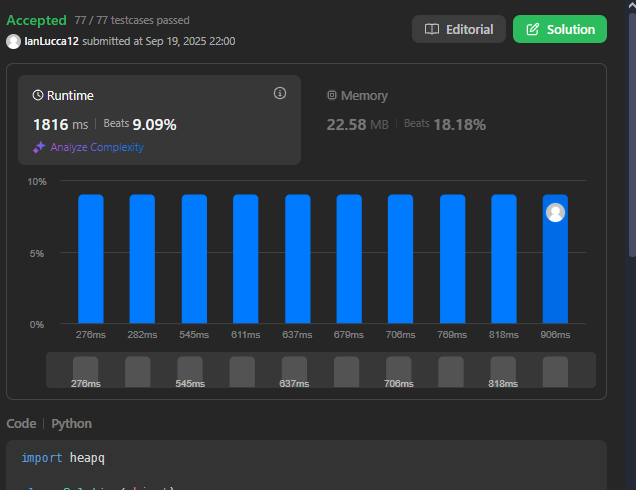
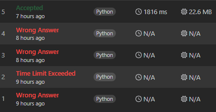

# Grafos 2: Resolvendo Problemas do LeetCode

**Número da Lista**: 2 
**Conteúdo da Disciplina**: Grafos 2  

### Participantes
Nome | Matrícula
|--|--|
[Christian Hirsch Santos](https://github.com/crstyhs)| 211045113
[Ian Lucca Soares Mesquita](https://github.com/IanLucca12) | 211045140 

## Sobre 
Foram escolhidos quatro exercícios da plataforma online [LeetCode](https://leetcode.com/):
- três de nível difícil.
- um de nível médio.

## Screenshots
### Questão
### [2492. Minimun Score of a Path Between Two Cities(Mid)](https://leetcode.com/problems/minimum-score-of-a-path-between-two-cities/description/)

### Envio correto

### Tentativas

**[Solução do Problema](hard/)**

### Questão
### [847. Shortest Path Visiting All Nodes(Hard)](https://leetcode.com/problems/shortest-path-visiting-all-nodes/description/)

### Envio correto

### Tentativas

**[Solução do Problema](hard/)**

### [2045. Second Minimum Time to Reach Destination](https://leetcode.com/problems/second-minimum-time-to-reach-destination/description)

### Envio correto

### Tentativas

**[Solução do Problema](hard/2045_Second_Minimum_Time_to_Reach_Destination.py)**

### [xxx. ]()

### Envio correto

### Tentativas

**[Solução do Problema](hard/)**

## Vídeo Explicativo

[Apresentação]()

## Linguagens
Python 

## Uso 
Rode os códigos no site do [LeetCode](https://leetcode.com/), em cada um dos problemas.